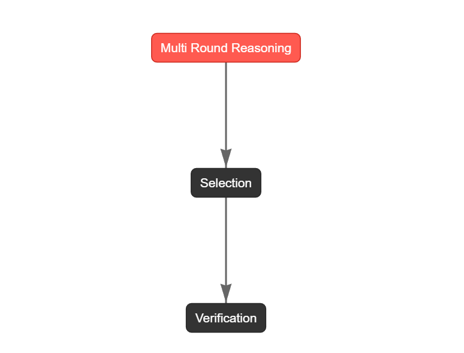

# Math Agent build with AI Agent frameworks
## Notes
This project is for reference and introductory learning only, for more information on the features and usage of each framework, please read the official documentation.


## Workflow
[Multi-round reasoning] --> [Answer selection] --> [Answer verification]


 

image generated by @[CrewAI](https://github.com/crewAIInc/crewAI)

## Usage
#### API Setting
```env
DEEPSEEK_API_KEY="your-api-key"
# or GOOGLE_API_KEY="your-api-key"
# or other providers
```


#### For CrewAI
```bash
cd crewai/math_solver
crewai install
crewai flow kickoff # or crewai run
# visualization
crewai flow plot
```

#### For Others
```bash
cd [folder name]
python main.py
```


## Frameworks

|          Framework          |                       Official Source                        |
| :-------------------------: | :----------------------------------------------------------: |
|      [CAMEL](./camel)       | [code](https://github.com/camel-ai/camel) / [docs](https://docs.camel-ai.org/) |
|  [LangChain](./langchain)   | [code](https://github.com/langchain-ai/langchain) / [docs](https://python.langchain.com/docs/introduction/) |
|       [Agno](./agno)        | [code](https://github.com/agno-agi/agno) / [docs](https://docs.agno.com/introduction) |
|    [AutoGen](./autogen)     | [code](https://github.com/microsoft/autogen) / [docs](https://microsoft.github.io/autogen/stable/) |
| [PocketFlow](./pocket_flow) | [code](https://github.com/The-Pocket/PocketFlow) / [docs](https://the-pocket.github.io/PocketFlow/) |
|     [CrewAI](./crewai)      | [code](https://github.com/crewAIInc/crewAI) / [docs](https://docs.crewai.com/introduction) |
|  [LangGraph](./langgraph)   | [code](https://github.com/langchain-ai/langgraph) / [docs](https://langchain-ai.github.io/langgraph/) |
